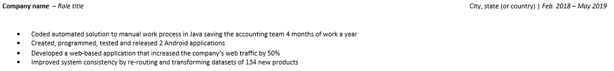

<section ng-if="critiquesAccessor" ng-show="isCurrentTab('feedback')" class="ng-scope" style=""> <!-- ngIf: hasFeedback && submission.result --><!-- end ngIf: hasFeedback && submission.result --> <!-- ngIf: submission.general_comment -->
 

 
<!-- end ngIf: submission.general_comment --> 
<!-- ngRepeat: section in critiquesAccessor.getSections() -->
 

 

 <h3 class="section-name ng-binding"> Targeted For Profession </h3> 
 <!-- ngRepeat: critique in critiques -->
 
 <!-- ngIf: isEditingCritique(critique.id) --> <!-- ngIf: !isEditingCritique(critique.id) -->

 
 
 
  
 
 
<ul>
<li>Prove the ability to succeed in job’s responsibilities in one of the following ways:<ul>
<li>If past experiences are not related to the job field or past work includes industry experience in a different role, resume includes a summary statement (1-2 sentences) that talks about how those experiences support the new career path and how past work or achievements transfer to desired role's responsibilities.</li>
<li>If past experience relates to the job field, the resume includes relevant keywords, skills, and experiences</li>
</ul>
</li>
</ul>

 <!-- ngIf: editable && critiqueLocked() --> 
 <!-- ngIf: editable && critiqueLocked() --> 
 <!-- ngIf: !!critique.observation --><!-- end ngIf: !!critique.observation --> <!-- ngIf: editable && !critiqueLocked() --> 
<!-- end ngIf: !isEditingCritique(critique.id) --> 
 
<!-- end ngRepeat: critique in critiques --> 
 
 
 
<!-- end ngRepeat: section in critiquesAccessor.getSections() -->
 

 

 <h3 class="section-name ng-binding"> General </h3> 
 <!-- ngRepeat: critique in critiques -->
 
 <!-- ngIf: isEditingCritique(critique.id) --> <!-- ngIf: !isEditingCritique(critique.id) -->

 
 
 
  
 
 
<ul>
<li>Resume is the appropriate length for showcasing the user's professional background:<ul>
<li>Entry-level job applicant resumes should only be 1 page maximum.</li>
<li>For candidates with 10+ years of work experience, any experience 5+ years ago should be limited to job title and company unless deeply relevant to the job posting.</li>
</ul>
</li>
<li>Resume is in PDF format.</li>
<li>Links are hyperlinked.</li>
<li>Resume uses one of the following standard orders:<ul>
<li>Heading, Skills, Projects in that order; Experience and Education in any order.</li>
<li>Heading; Education or Experience in any order; Projects, Skills in that order.</li>
</ul>
</li>
</ul>

 <!-- ngIf: editable && critiqueLocked() --> 
 <!-- ngIf: editable && critiqueLocked() --> 
 <!-- ngIf: !!critique.observation --><!-- end ngIf: !!critique.observation --> <!-- ngIf: editable && !critiqueLocked() --> 
<!-- end ngIf: !isEditingCritique(critique.id) --> 
 
<!-- end ngRepeat: critique in critiques -->
 
 <!-- ngIf: isEditingCritique(critique.id) --> <!-- ngIf: !isEditingCritique(critique.id) -->

 
 
 
  
 
 
<ul>
<li>Spelling and grammar are correct.</li>
<li>Correct tense is used in bullet points (past tense for previous, current tense for ongoing) and consistent.</li>
<li>Resume does not include: age, gender, marital status, photo, or mention of references.</li>
<li>Resume uses positive language.</li>
<li>Resume does not indicate that the candidate is seeking a job because this may be extraneous or redundant information.</li>
</ul>

 <!-- ngIf: editable && critiqueLocked() --> 
 <!-- ngIf: editable && critiqueLocked() --> 
 <!-- ngIf: !!critique.observation --><!-- end ngIf: !!critique.observation --> <!-- ngIf: editable && !critiqueLocked() --> 
<!-- end ngIf: !isEditingCritique(critique.id) --> 
 
<!-- end ngRepeat: critique in critiques -->
 
 <!-- ngIf: isEditingCritique(critique.id) --> <!-- ngIf: !isEditingCritique(critique.id) -->

 
 
 
  
 
 
<ul>
<li>Name is at the top of the page and larger than other text.</li>
<li>Section headings, company names, and titles are made distinct from other text through capitalization or bolded font.</li>
<li>Content is horizontally optimized in the following ways:<ul>
<li>Uses space well for a reader to scan from top to bottom.</li>
<li>Condenses lists for single words to the same line.</li>
<li>There are no lines that are words “dangling” from the end of the previous line’s sentence.</li>
</ul>
</li>
</ul>

 <!-- ngIf: editable && critiqueLocked() --> 
 <!-- ngIf: editable && critiqueLocked() --> 
 <!-- ngIf: !!critique.observation --><!-- end ngIf: !!critique.observation --> <!-- ngIf: editable && !critiqueLocked() --> 
<!-- end ngIf: !isEditingCritique(critique.id) --> 
 
<!-- end ngRepeat: critique in critiques -->
 
 <!-- ngIf: isEditingCritique(critique.id) --> <!-- ngIf: !isEditingCritique(critique.id) -->

 
 
 
  
 
 
<ul>
<li>All text is aligned to the left and/or right axis.</li>
<li>Within sections (ie: bullet points) or groups (ie: headers), there are no inconsistencies in the following:<ul>
<li>font color</li>
<li>type or size</li>
<li>margin-size</li>
<li>spacing</li>
</ul>
</li>
<li>Font is professional. Examples are serif fonts like Times New Roman or sans-serif fonts like Verdana.</li>
<li>Bullet points and formatting such as bolded font are consistent across all sections.</li>
</ul>

 <!-- ngIf: editable && critiqueLocked() --> 
 <!-- ngIf: editable && critiqueLocked() --> 
 <!-- ngIf: !!critique.observation --><!-- end ngIf: !!critique.observation --> <!-- ngIf: editable && !critiqueLocked() --> 
<!-- end ngIf: !isEditingCritique(critique.id) --> 
 
<!-- end ngRepeat: critique in critiques --> 
 
 
 
<!-- end ngRepeat: section in critiquesAccessor.getSections() -->
 

 

 <h3 class="section-name ng-binding"> Heading </h3> 
 <!-- ngRepeat: critique in critiques -->
 
 <!-- ngIf: isEditingCritique(critique.id) --> <!-- ngIf: !isEditingCritique(critique.id) -->

 
 
 
  
 
 

Heading includes:

<ul>
<li>Full name</li>
<li>Phone number</li>
<li>Email</li>
<li>Location</li>
<li>Links to LinkedIn, GitHub and/or personal website</li>
</ul>

 <!-- ngIf: editable && critiqueLocked() --> 
 <!-- ngIf: editable && critiqueLocked() --> 
 <!-- ngIf: !!critique.observation --><!-- end ngIf: !!critique.observation --> <!-- ngIf: editable && !critiqueLocked() --> 
<!-- end ngIf: !isEditingCritique(critique.id) --> 
 
<!-- end ngRepeat: critique in critiques --> 
 
 
 
<!-- end ngRepeat: section in critiquesAccessor.getSections() -->
 

 

 <h3 class="section-name ng-binding"> Education </h3> 
 <!-- ngRepeat: critique in critiques -->
 
 <!-- ngIf: isEditingCritique(critique.id) --> <!-- ngIf: !isEditingCritique(critique.id) -->

 
 
 
  
 
 
<ul>
<li>Relevant and recent education is included.<ul>
<li>If the candidate is working on/has completed a Nanodegree program, it should be included in this section, even if incomplete</li>
<li>Any college, including major and/or relevant courses, are included.</li>
</ul>
</li>
<li>For incomplete education that is not in progress, users can frame this experience positively by focusing on what they did complete. For example: "60 credits toward a Bachelor's degree in Computer Science" or "Courses completed in computer science, design, communications."</li>
</ul>

 <!-- ngIf: editable && critiqueLocked() --> 
 <!-- ngIf: editable && critiqueLocked() --> 
 <!-- ngIf: !!critique.observation --><!-- end ngIf: !!critique.observation --> <!-- ngIf: editable && !critiqueLocked() --> 
<!-- end ngIf: !isEditingCritique(critique.id) --> 
 
<!-- end ngRepeat: critique in critiques --> 
 
 
 
<!-- end ngRepeat: section in critiquesAccessor.getSections() -->
 

 

 <h3 class="section-name ng-binding"> Skills </h3> 
 <!-- ngRepeat: critique in critiques -->
 
 <!-- ngIf: isEditingCritique(critique.id) --> <!-- ngIf: !isEditingCritique(critique.id) -->

 
 
 
  
 
 
<ul>
<li>Relevant and challenging technologies such as programming languages, frameworks, version control systems, databases, operating systems, image/video/audio editing software, etc. are listed, with ones of the highest level of proficiency mentioned first.</li>
<li>Skills should only be technical or specialized to the job, and must to be relevant to the desired role.</li>
<li>Conveys level of expertise for the skills listed. This can be done in a few ways, such as: <ul>
<li>For candidates with a wide range of skills, an experience scale can show that they are well-rounded and have expertise in certain areas.</li>
<li>Skills can also be segmented under categories such as “proficient” and “moderate” for better readability.</li>
</ul>
</li>
<li>Microsoft Office, Google Drive, Mac &amp; PC are not listed (unless the job description specifies that they are needed), because it is assumed someone knows or can quickly learn these skills.</li>
</ul>

 <!-- ngIf: editable && critiqueLocked() --> 
 <!-- ngIf: editable && critiqueLocked() --> 
 <!-- ngIf: !!critique.observation --><!-- end ngIf: !!critique.observation --> <!-- ngIf: editable && !critiqueLocked() --> 
<!-- end ngIf: !isEditingCritique(critique.id) --> 
 
<!-- end ngRepeat: critique in critiques --> 
 
 
 
<!-- end ngRepeat: section in critiquesAccessor.getSections() -->
 

 

 <h3 class="section-name ng-binding"> Projects </h3> 
 <!-- ngRepeat: critique in critiques -->
 
 <!-- ngIf: isEditingCritique(critique.id) --> <!-- ngIf: !isEditingCritique(critique.id) -->

 
 
 
  
 
 
<ul>
<li>Only most relevant projects are listed starting with most recent. This can include personal, academic or work projects.</li>
<li>Only includes about 2-3 projects.</li>
<li>Each project includes the information:<ul>
<li>Title of project</li>
<li>Start and end date</li>
<li>Any other key information, such as if it were a competition</li>
</ul>
</li>
</ul>

 <!-- ngIf: editable && critiqueLocked() --> 
 <!-- ngIf: editable && critiqueLocked() --> 
 <!-- ngIf: !!critique.observation --><!-- end ngIf: !!critique.observation --> <!-- ngIf: editable && !critiqueLocked() --> 
<!-- end ngIf: !isEditingCritique(critique.id) --> 
 
<!-- end ngRepeat: critique in critiques -->
 
 <!-- ngIf: isEditingCritique(critique.id) --> <!-- ngIf: !isEditingCritique(critique.id) -->

 
 
 
  
 
 
<ul>
<li>Maximum 2-3 bullet points per project.</li>
<li>Within each project:<ul>
<li>At least 1 bullet point demonstrates individual contribution.</li>
<li>At least 1 bullet point communicates project result (success metrics, findings).</li>
</ul>
</li>
</ul>

 <!-- ngIf: editable && critiqueLocked() --> 
 <!-- ngIf: editable && critiqueLocked() --> 
 <!-- ngIf: !!critique.observation --><!-- end ngIf: !!critique.observation --> <!-- ngIf: editable && !critiqueLocked() --> 
<!-- end ngIf: !isEditingCritique(critique.id) --> 
 
<!-- end ngRepeat: critique in critiques --> 
 
 
 
<!-- end ngRepeat: section in critiquesAccessor.getSections() -->
 

 

 <h3 class="section-name ng-binding"> Experience </h3> 
 <!-- ngRepeat: critique in critiques -->
 
 <!-- ngIf: isEditingCritique(critique.id) --> <!-- ngIf: !isEditingCritique(critique.id) -->

 
 
 
  
 
 
<ul>
<li>Each experience includes the following:<ul>
<li>Company/organization</li>
<li>Title of role</li>
<li>Start and end date (month &amp; year)</li>
<li>Location</li>
</ul>
</li>
</ul>

 <!-- ngIf: editable && critiqueLocked() --> 
 <!-- ngIf: editable && critiqueLocked() --> 
 <!-- ngIf: !!critique.observation --> <!-- ngIf: editable && !critiqueLocked() --> 
<!-- end ngIf: !isEditingCritique(critique.id) --> 
 
<!-- end ngRepeat: critique in critiques -->
 
 <!-- ngIf: isEditingCritique(critique.id) --> <!-- ngIf: !isEditingCritique(critique.id) -->

 
 
 
  
 
 
<ul>
<li>Determine the appropriate number of work experiences, depending on the user's individual background:<ul>
<li>Entry-level resumes should include all previous roles to demonstrate work history, including internships and volunteer roles. If the user has no experiences, consider if it would be appropriate to market themselves as an independent or freelance worker.</li>
<li>People with resumes with less than 2 work experiences should consider adding another project in the Project section.</li>
<li>People with more than 4 work experiences should decrease the number of bullet points for older roles. Any roles from 10+ years ago (unless highly relevant to the desired role) or short/redundant roles that don’t create a large gap in work history do not need to be included.</li>
</ul>
</li>
</ul>

 <!-- ngIf: editable && critiqueLocked() --> 
 <!-- ngIf: editable && critiqueLocked() --> 
 <!-- ngIf: !!critique.observation --> <!-- ngIf: editable && !critiqueLocked() --> 
<!-- end ngIf: !isEditingCritique(critique.id) --> 
 
<!-- end ngRepeat: critique in critiques -->
 
 <!-- ngIf: isEditingCritique(critique.id) --> <!-- ngIf: !isEditingCritique(critique.id) -->

 
 
 
  
 
 
<ul>
<li>Maximum 4 bullet points; there should be no sub-bullet points.</li>
<li>Bullet points start with action verbs.</li>
<li>Within each job listing:<ul>
<li>At least 1 bullet point communicates how candidate benefited company or cause.</li>
<li>At least 1 bullet point provides concrete, numerical evidence such as projects completed, money made, people managed, accomplishments (eg. % increase).</li>
</ul>
</li>
<li>Bullet points are one sentence maximum, not longer than one-and-a-half lines.</li>
</ul>

 <!-- ngIf: editable && critiqueLocked() --> 
 <!-- ngIf: editable && critiqueLocked() --> 
 <!-- ngIf: !!critique.observation -->
 
 
 

<section ng-if="critiquesAccessor" ng-show="isCurrentTab('feedback')" class="ng-scope" style=""> <!-- ngIf: hasFeedback && submission.result --><!-- end ngIf: hasFeedback && submission.result --> <!-- ngIf: submission.general_comment -->
 

 
<!-- end ngIf: submission.general_comment --> 
<!-- ngRepeat: section in critiquesAccessor.getSections() -->
 

 

 <h3 class="section-name ng-binding"> Targeted For Profession </h3> 
 <!-- ngRepeat: critique in critiques -->
 
 <!-- ngIf: isEditingCritique(critique.id) --> <!-- ngIf: !isEditingCritique(critique.id) -->

 
 
 
  
 
 
<ul>
<li>Prove the ability to succeed in job’s responsibilities in one of the following ways:<ul>
<li>If past experiences are not related to the job field or past work includes industry experience in a different role, resume includes a summary statement (1-2 sentences) that talks about how those experiences support the new career path and how past work or achievements transfer to desired role's responsibilities.</li>
<li>If past experience relates to the job field, the resume includes relevant keywords, skills, and experiences</li>
</ul>
</li>
</ul>

 <!-- ngIf: editable && critiqueLocked() --> 
 <!-- ngIf: editable && critiqueLocked() --> 
 <!-- ngIf: !!critique.observation --><!-- end ngIf: !!critique.observation --> <!-- ngIf: editable && !critiqueLocked() --> 
<!-- end ngIf: !isEditingCritique(critique.id) --> 
 
<!-- end ngRepeat: critique in critiques --> 
 
 
 
<!-- end ngRepeat: section in critiquesAccessor.getSections() -->
 

 

 <h3 class="section-name ng-binding"> General </h3> 
 <!-- ngRepeat: critique in critiques -->
 
 <!-- ngIf: isEditingCritique(critique.id) --> <!-- ngIf: !isEditingCritique(critique.id) -->

 
 
 
  
 
 
<ul>
<li>Resume is the appropriate length for showcasing the user's professional background:<ul>
<li>Entry-level job applicant resumes should only be 1 page maximum.</li>
<li>For candidates with 10+ years of work experience, any experience 5+ years ago should be limited to job title and company unless deeply relevant to the job posting.</li>
</ul>
</li>
<li>Resume is in PDF format.</li>
<li>Links are hyperlinked.</li>
<li>Resume uses one of the following standard orders:<ul>
<li>Heading, Skills, Projects in that order; Experience and Education in any order.</li>
<li>Heading; Education or Experience in any order; Projects, Skills in that order.</li>
</ul>
</li>
</ul>

 <!-- ngIf: editable && critiqueLocked() --> 
 <!-- ngIf: editable && critiqueLocked() --> 
 <!-- ngIf: !!critique.observation --><!-- end ngIf: !!critique.observation --> <!-- ngIf: editable && !critiqueLocked() --> 
<!-- end ngIf: !isEditingCritique(critique.id) --> 
 
<!-- end ngRepeat: critique in critiques -->
 
 <!-- ngIf: isEditingCritique(critique.id) --> <!-- ngIf: !isEditingCritique(critique.id) -->

 
 
 
  
 
 
<ul>
<li>Spelling and grammar are correct.</li>
<li>Correct tense is used in bullet points (past tense for previous, current tense for ongoing) and consistent.</li>
<li>Resume does not include: age, gender, marital status, photo, or mention of references.</li>
<li>Resume uses positive language.</li>
<li>Resume does not indicate that the candidate is seeking a job because this may be extraneous or redundant information.</li>
</ul>

 <!-- ngIf: editable && critiqueLocked() --> 
 <!-- ngIf: editable && critiqueLocked() --> 
 <!-- ngIf: !!critique.observation --><!-- end ngIf: !!critique.observation --> <!-- ngIf: editable && !critiqueLocked() --> 
<!-- end ngIf: !isEditingCritique(critique.id) --> 
 
<!-- end ngRepeat: critique in critiques -->
 
 <!-- ngIf: isEditingCritique(critique.id) --> <!-- ngIf: !isEditingCritique(critique.id) -->

 
 
 
  
 
 
<ul>
<li>Name is at the top of the page and larger than other text.</li>
<li>Section headings, company names, and titles are made distinct from other text through capitalization or bolded font.</li>
<li>Content is horizontally optimized in the following ways:<ul>
<li>Uses space well for a reader to scan from top to bottom.</li>
<li>Condenses lists for single words to the same line.</li>
<li>There are no lines that are words “dangling” from the end of the previous line’s sentence.</li>
</ul>
</li>
</ul>

 <!-- ngIf: editable && critiqueLocked() --> 
 <!-- ngIf: editable && critiqueLocked() --> 
 <!-- ngIf: !!critique.observation --><!-- end ngIf: !!critique.observation --> <!-- ngIf: editable && !critiqueLocked() --> 
<!-- end ngIf: !isEditingCritique(critique.id) --> 
 
<!-- end ngRepeat: critique in critiques -->
 
 <!-- ngIf: isEditingCritique(critique.id) --> <!-- ngIf: !isEditingCritique(critique.id) -->

 
 
 
  
 
 
<ul>
<li>All text is aligned to the left and/or right axis.</li>
<li>Within sections (ie: bullet points) or groups (ie: headers), there are no inconsistencies in the following:<ul>
<li>font color</li>
<li>type or size</li>
<li>margin-size</li>
<li>spacing</li>
</ul>
</li>
<li>Font is professional. Examples are serif fonts like Times New Roman or sans-serif fonts like Verdana.</li>
<li>Bullet points and formatting such as bolded font are consistent across all sections.</li>
</ul>

 <!-- ngIf: editable && critiqueLocked() --> 
 <!-- ngIf: editable && critiqueLocked() --> 
 <!-- ngIf: !!critique.observation --><!-- end ngIf: !!critique.observation --> <!-- ngIf: editable && !critiqueLocked() --> 
<!-- end ngIf: !isEditingCritique(critique.id) --> 
 
<!-- end ngRepeat: critique in critiques --> 
 
 
 
<!-- end ngRepeat: section in critiquesAccessor.getSections() -->
 

 

 <h3 class="section-name ng-binding"> Heading </h3> 
 <!-- ngRepeat: critique in critiques -->
 
 <!-- ngIf: isEditingCritique(critique.id) --> <!-- ngIf: !isEditingCritique(critique.id) -->

 
 
 
  
 
 

Heading includes:

<ul>
<li>Full name</li>
<li>Phone number</li>
<li>Email</li>
<li>Location</li>
<li>Links to LinkedIn, GitHub and/or personal website</li>
</ul>

 <!-- ngIf: editable && critiqueLocked() --> 
 <!-- ngIf: editable && critiqueLocked() --> 
 <!-- ngIf: !!critique.observation --><!-- end ngIf: !!critique.observation --> <!-- ngIf: editable && !critiqueLocked() --> 
<!-- end ngIf: !isEditingCritique(critique.id) --> 
 
<!-- end ngRepeat: critique in critiques --> 
 
 
 
<!-- end ngRepeat: section in critiquesAccessor.getSections() -->
 

 

 <h3 class="section-name ng-binding"> Education </h3> 
 <!-- ngRepeat: critique in critiques -->
 
 <!-- ngIf: isEditingCritique(critique.id) --> <!-- ngIf: !isEditingCritique(critique.id) -->

 
 
 
  
 
 
<ul>
<li>Relevant and recent education is included.<ul>
<li>If the candidate is working on/has completed a Nanodegree program, it should be included in this section, even if incomplete</li>
<li>Any college, including major and/or relevant courses, are included.</li>
</ul>
</li>
<li>For incomplete education that is not in progress, users can frame this experience positively by focusing on what they did complete. For example: "60 credits toward a Bachelor's degree in Computer Science" or "Courses completed in computer science, design, communications."</li>
</ul>

 <!-- ngIf: editable && critiqueLocked() --> 
 <!-- ngIf: editable && critiqueLocked() --> 
 <!-- ngIf: !!critique.observation --><!-- end ngIf: !!critique.observation --> <!-- ngIf: editable && !critiqueLocked() --> 
<!-- end ngIf: !isEditingCritique(critique.id) --> 
 
<!-- end ngRepeat: critique in critiques --> 
 
 
 
<!-- end ngRepeat: section in critiquesAccessor.getSections() -->
 

 

 <h3 class="section-name ng-binding"> Skills </h3> 
 <!-- ngRepeat: critique in critiques -->
 
 <!-- ngIf: isEditingCritique(critique.id) --> <!-- ngIf: !isEditingCritique(critique.id) -->

 
 
 
  
 
 
<ul>
<li>Relevant and challenging technologies such as programming languages, frameworks, version control systems, databases, operating systems, image/video/audio editing software, etc. are listed, with ones of the highest level of proficiency mentioned first.</li>
<li>Skills should only be technical or specialized to the job, and must to be relevant to the desired role.</li>
<li>Conveys level of expertise for the skills listed. This can be done in a few ways, such as: <ul>
<li>For candidates with a wide range of skills, an experience scale can show that they are well-rounded and have expertise in certain areas.</li>
<li>Skills can also be segmented under categories such as “proficient” and “moderate” for better readability.</li>
</ul>
</li>
<li>Microsoft Office, Google Drive, Mac &amp; PC are not listed (unless the job description specifies that they are needed), because it is assumed someone knows or can quickly learn these skills.</li>
</ul>

 <!-- ngIf: editable && critiqueLocked() --> 
 <!-- ngIf: editable && critiqueLocked() --> 
 <!-- ngIf: !!critique.observation --><!-- end ngIf: !!critique.observation --> <!-- ngIf: editable && !critiqueLocked() --> 
<!-- end ngIf: !isEditingCritique(critique.id) --> 
 
<!-- end ngRepeat: critique in critiques --> 
 
 
 
<!-- end ngRepeat: section in critiquesAccessor.getSections() -->
 

 

 <h3 class="section-name ng-binding"> Projects </h3> 
 <!-- ngRepeat: critique in critiques -->
 
 <!-- ngIf: isEditingCritique(critique.id) --> <!-- ngIf: !isEditingCritique(critique.id) -->

 
 
 
  
 
 
<ul>
<li>Only most relevant projects are listed starting with most recent. This can include personal, academic or work projects.</li>
<li>Only includes about 2-3 projects.</li>
<li>Each project includes the information:<ul>
<li>Title of project</li>
<li>Start and end date</li>
<li>Any other key information, such as if it were a competition</li>
</ul>
</li>
</ul>

 <!-- ngIf: editable && critiqueLocked() --> 
 <!-- ngIf: editable && critiqueLocked() --> 
 <!-- ngIf: !!critique.observation --><!-- end ngIf: !!critique.observation --> <!-- ngIf: editable && !critiqueLocked() --> 
<!-- end ngIf: !isEditingCritique(critique.id) --> 
 
<!-- end ngRepeat: critique in critiques -->
 
 <!-- ngIf: isEditingCritique(critique.id) --> <!-- ngIf: !isEditingCritique(critique.id) -->

 
 
 
  
 
 
<ul>
<li>Maximum 2-3 bullet points per project.</li>
<li>Within each project:<ul>
<li>At least 1 bullet point demonstrates individual contribution.</li>
<li>At least 1 bullet point communicates project result (success metrics, findings).</li>
</ul>
</li>
</ul>

 <!-- ngIf: editable && critiqueLocked() --> 
 <!-- ngIf: editable && critiqueLocked() --> 
 <!-- ngIf: !!critique.observation --><!-- end ngIf: !!critique.observation --> <!-- ngIf: editable && !critiqueLocked() --> 
<!-- end ngIf: !isEditingCritique(critique.id) --> 
 
<!-- end ngRepeat: critique in critiques --> 
 
 
 
<!-- end ngRepeat: section in critiquesAccessor.getSections() -->
 

 

 <h3 class="section-name ng-binding"> Experience </h3> 
 <!-- ngRepeat: critique in critiques -->
 
 <!-- ngIf: isEditingCritique(critique.id) --> <!-- ngIf: !isEditingCritique(critique.id) -->

 
 
 
  
 
 
<ul>
<li>Each experience includes the following:<ul>
<li>Company/organization</li>
<li>Title of role</li>
<li>Start and end date (month &amp; year)</li>
<li>Location</li>
</ul>
</li>
</ul>

 <!-- ngIf: editable && critiqueLocked() --> 
 <!-- ngIf: editable && critiqueLocked() --> 
 <!-- ngIf: !!critique.observation --> <!-- ngIf: editable && !critiqueLocked() --> 
<!-- end ngIf: !isEditingCritique(critique.id) --> 
 
<!-- end ngRepeat: critique in critiques -->
 
 <!-- ngIf: isEditingCritique(critique.id) --> <!-- ngIf: !isEditingCritique(critique.id) -->

 
 
 
  
 
 
<ul>
<li>Determine the appropriate number of work experiences, depending on the user's individual background:<ul>
<li>Entry-level resumes should include all previous roles to demonstrate work history, including internships and volunteer roles. If the user has no experiences, consider if it would be appropriate to market themselves as an independent or freelance worker.</li>
<li>People with resumes with less than 2 work experiences should consider adding another project in the Project section.</li>
<li>People with more than 4 work experiences should decrease the number of bullet points for older roles. Any roles from 10+ years ago (unless highly relevant to the desired role) or short/redundant roles that don’t create a large gap in work history do not need to be included.</li>
</ul>
</li>
</ul>

 <!-- ngIf: editable && critiqueLocked() --> 
 <!-- ngIf: editable && critiqueLocked() --> 
 <!-- ngIf: !!critique.observation --> <!-- ngIf: editable && !critiqueLocked() --> 
<!-- end ngIf: !isEditingCritique(critique.id) --> 
 
<!-- end ngRepeat: critique in critiques -->
 
 <!-- ngIf: isEditingCritique(critique.id) --> <!-- ngIf: !isEditingCritique(critique.id) -->

 
 
 
  
 
 
<ul>
<li>Maximum 4 bullet points; there should be no sub-bullet points.</li>
<li>Bullet points start with action verbs.</li>
<li>Within each job listing:<ul>
<li>At least 1 bullet point communicates how candidate benefited company or cause.</li>
<li>At least 1 bullet point provides concrete, numerical evidence such as projects completed, money made, people managed, accomplishments (eg. % increase).</li>
</ul>
</li>
<li>Bullet points are one sentence maximum, not longer than one-and-a-half lines.</li>
</ul>

 
 
 
 
 

